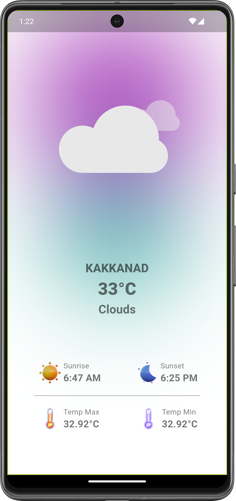
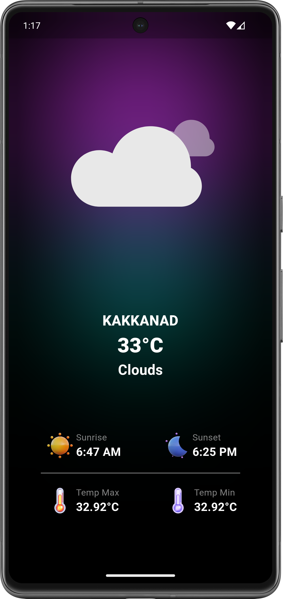

# Flutter Weather App

A simple Flutter weather app that displays real-time weather information based on the user's
location using the OpenWeatherMap API.

## Features

- Fetches current weather data for the user's location
- Displays temperature, weather condition, sunrise, sunset, and more
- Animated weather illustrations based on current weather conditions
- Clean and responsive UI design
- Supports both dark and light themes

## Screenshots

 

## Getting Started

### Prerequisites

- Flutter installed on your machine. For installation instructions,
  visit [Flutter Installation Guide](https://flutter.dev/docs/get-started/install).

### Installation

1. Clone the repository:

    ```bash
    git clone https://github.com/your-username/flutter-weather-app.git
    ```

2. Change into the project directory:

    ```bash
    cd flutter-weather-app
    ```

3. Install dependencies:

    ```bash
    flutter pub get
    ```

4. Obtain an API key from [OpenWeatherMap](https://openweathermap.org/) and replace `YOUR_API_KEY`
   in `lib/api_keys.dart` with your actual API key.

### Usage

Run the app on an emulator or physical device:

```bash
flutter run
  ```

## Theme Switching

The app supports both light and dark themes. The theme is determined based on the system theme (
light/dark) by default. You can manually toggle between themes in the app settings.

## Dependencies

- [http](https://pub.dev/packages/http) for making HTTP requests.
- [geolocator](https://pub.dev/packages/geolocator) for retrieving the user's location.
- [lottie](https://pub.dev/packages/lottie) for displaying Lottie animations.
- [geocoding](https://pub.dev/packages/geocoding) for converting coordinates to location names.

## Contributing

Contributions are welcome! Feel free to open issues or submit pull requests.

## License

This project is licensed under the MIT License - see the [LICENSE](LICENSE) file for details.

## Acknowledgments

- Weather data provided by [OpenWeatherMap](https://openweathermap.org/).
- Lottie animations by [LottieFiles](https://lottiefiles.com/).
